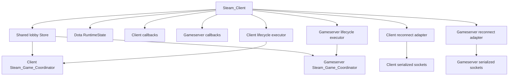
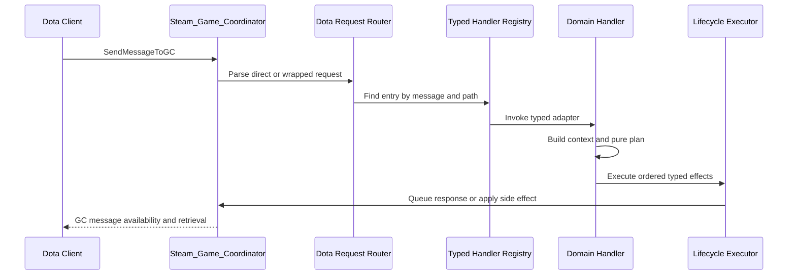
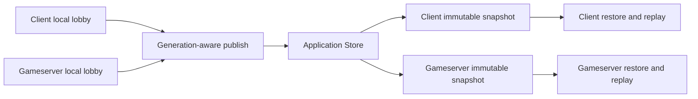
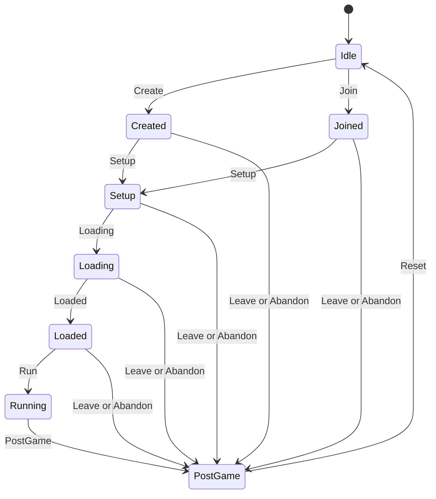
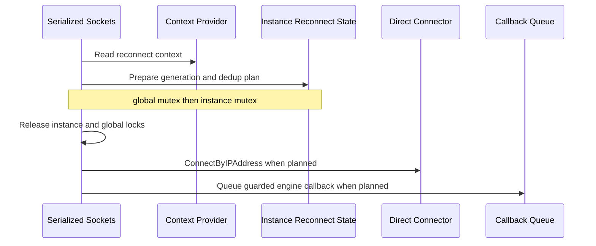

# GBE Fork Architecture

## Overview

GBE Fork is a C++ Steam emulator fork with platform-specific build targets, Steam API implementations, loaders, tools, and protocol helpers. The Dota Game Coordinator subsystem emulates selected GC request, lobby, custom-game, inventory, chat, replay, and reconnect behavior.

The Dota GC architecture uses explicit ownership and narrow decision boundaries while preserving existing Steam-facing APIs and wire behavior. Production runtime ownership is rooted in `Steam_Client`. Each client or gameserver role receives its own coordinator, reconnect adapter, serialized connection state, and lifecycle executor, while both roles share one application-owned lobby Store.

The maintenance model is:

```text
wire request
  -> request context and routing
  -> handler
  -> pure planner or transition
  -> ordered typed effects
  -> coordinator-owned executor
  -> Store, queue, callback, or network adapter
```

## Technology

- Primary language: C++17.
- Build generation: Premake.
- Linux production build: GNU Make through repository-provided Premake.
- Windows production build: Visual Studio/MSBuild through repository-provided Premake.
- Focused verification: Bash, Python 3, GCC or Clang.
- Concurrency verification: Clang ThreadSanitizer.
- CI: GitHub Actions with Windows, Linux, GC verification, and TSAN jobs.
- Dependencies: Git Submodules under `third-party/`.

## Repository Structure

```text
gbe_fork/
|-- dll/                         # Steam API and production implementation
|   |-- steam_client.cpp         # Production application composition root
|   |-- steam_game_coordinator.cpp
|   |-- gbe_dota_*.{h,cpp}       # Dota GC domains, adapters, and helpers
|   `-- dll/                     # Public and internal class headers
|-- tools/                       # Focused tests, replay tools, and verification scripts
|-- docs/gc/                     # Maintained GC reference contracts and history
|-- .monkeycode/docs/            # Maintenance Wiki
|-- .monkeycode/specs/           # Feature specifications and completed task records
|-- .github/workflows/           # Production and GC CI gates
|-- post_build/                  # Runtime examples and release guidance
|-- third-party/                 # Git Submodules and build dependencies
`-- premake5.lua                 # Project and target definitions
```

## Production Ownership

`Steam_Client` is the production composition root. It owns the shared lobby backing state, Store, runtime state, networking, callbacks, reconnect adapters, serialized sockets, lifecycle executors, and client/gameserver coordinators.



The logical lifecycle order is:

```text
Settings -> Network -> Callbacks -> Store -> Services -> Coordinator
```

`gbe::dota::LocatorBindingGuard` publishes the application-owned Store and runtime state after base services exist and before either coordinator is constructed. Partial binding and constructor failure roll back automatically. Destruction follows the reverse dependency order, with both coordinators destroyed before the guard is reset.

The standalone `gbe::dota::CompositionRoot` in `dll/gbe_dota_composition_root.*` is a focused ownership model used by offline tests. Production currently performs equivalent assembly directly in `Steam_Client`; maintainers should treat `Steam_Client` as the runtime authority.

## Coordinator Responsibilities

Each `Steam_Game_Coordinator` owns role-local state and queues:

- `GBE_LocalLobby`.
- Pending and incoming GC messages.
- Monotonic lobby generation counter.
- Deferred teardown and lifecycle slots.
- Launch, replay, and role-local transient state.

The coordinator receives explicit references to the shared Store, typed handler registry, lifecycle executor, settings, networking, storage, and callback infrastructure.

Client and gameserver local lobby state remain separate. Shared coordination occurs through the application Store, using immutable snapshots and generation-aware commits.

## Request Routing

Direct and wrapped GC requests are normalized into `DotaGcRequestContext`. The context records the inner message ID, request body, source and target jobs, request path, and wrapped session metadata.



The production typed registry and dispatcher live in `dll/gbe_dota_post_login_dispatcher.cpp`. Production builds and the offline handler harness compile this same implementation. Each entry defines:

- Message ID.
- Direct, wrapped, or dual request mode.
- Wrapped-session forwarding policy.
- Lifecycle risk class.
- Adapter and handler identity.
- High-risk smoke or replay fixture metadata.

Special handlers with custom context shaping remain explicit outside the table until their routing contract can be unified safely.

## Handler And Effect Boundaries

Handlers perform protocol parsing, context mapping, planner invocation, response adaptation, and structured logging. Pure planners and transitions decide state changes and action ordering. Executors own observable side effects.

Typical side effects include:

- GC response or notification pushes.
- Shared lobby publication.
- Settings and rich-presence updates.
- Generic lobby operations.
- Callback queue insertion.
- Steam network connection attempts.
- Delayed runtime updates and teardown finalization.

`GBE_DotaActionList` is the ordered contract between planning and execution for multi-effect paths. Action ordering is protocol behavior and must remain stable.

## Shared Lobby Store

`gbe::dota_lobby_state::Store` wraps one shared `GBE_SharedDotaLobbyState` and the existing recursive process mutex. Its public behavior is value-based:

- `snapshot()` returns an immutable copy.
- `publish()` commits a complete value.
- Monotonic publish rejects older generations.
- `compare_update()` accepts only the expected generation.
- `compare_clear()` clears only the expected generation and preserves that generation as a tombstone.
- A tombstone rejects same-generation republish and permits a newer generation to replace it.
- `clear()` remains available for test and process-level forced reset.

Every business operation captures one complete snapshot and derives all decisions from that version. Store mutators transform a copied candidate and perform no network, callback, logging, filesystem, or coordinator effects.



## Lifecycle State Machine

The core lifecycle vocabulary is dependency-light and `constexpr`:

- States: `Idle`, `Created`, `Joined`, `Setup`, `Loading`, `Loaded`, `Running`, `PostGame`.
- Events include create, join, setup, loading, loaded, run, postgame, leave, abandon, reset, generation, reconnect, runtime, and teardown categories.
- Compile-time checks classify all state/event pairs.



The state machine authorizes transitions and emits typed effect requests. Existing planners and executors remain responsible for payloads and production side effects.

## Generation And Asynchronous Safety

Generation is the process-local lobby lifecycle epoch. Create, join, leave, reset, and recovery boundaries advance it monotonically. The counter saturates at `uint64_t` maximum and never wraps.

Asynchronous work captures generation at creation and validates it at the final execution boundary:

- Delayed GC messages capture lobby ID and generation.
- Deferred lifecycle slots capture lobby ID and generation.
- Reconnect callbacks carry generation execution guards.
- Runtime updates carry the current generation.
- Store writes reject stale generations.

This prevents a delayed operation from an old lifecycle from modifying a new lifecycle that reused the same wire lobby ID.

## Reconnect Architecture

Reconnect uses three narrow ports:

- Context provider.
- Direct connector.
- Callback queue.

`GBE_DotaReconnectNetworkAdapter` implements these ports for production. Client and gameserver roles each own an independent adapter and serialized connection state.

Reconnect context priority is:

```text
Shared -> Recent -> Local -> GenericRecovery
```

The orchestration is divided into pure preparation and external execution:



The dedup identity is generation, server ID, and endpoint. External network and callback effects execute after both locks are released.

## Message Retrieval As A Lifecycle Boundary

Some teardown effects finalize when the client retrieves a protocol-visible message. For example, retrieval of selected unsubscribe or postgame messages can consume a generation-guarded deferred slot and complete cleanup.

Maintainers must preserve this observable boundary. Moving finalization from retrieval time to queue time can change protocol order and allow stale cleanup to affect a replacement lobby.

## Architecture Authority

Current architecture decisions are protected by:

- `tools/_audit_gc_refactor.py`.
- `tools/test_audit_gc_refactor.py`.
- `tools/run_gc_verification.sh`.
- `tools/run_gc_tsan_tests.sh`.
- `docs/gc/architecture-investment-gates.md`.
- `.monkeycode/specs/gc-refactor-next-phase/tasklist.md`.
