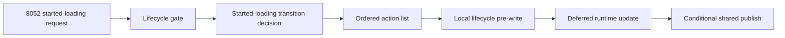

# 8052 Lifecycle Pre-write 后续设计

Feature Name: gc-8052-lifecycle-pre-write
Updated: 2026-07-25
Status: 待实施

## 描述

该设计为 8052 的 Local lifecycle pre-write 建立可观测的 action 边界。纯 decision 继续计算 transition；action list 继续表达执行顺序；executor 在任何 protocol push、deferred runtime update 与 fallback publish 前按 action 类型完成 Local 变更。实现阶段通过最小改动显式化 pre-write，不扩大 7041/8053 或通用生命周期范围。

## 架构

## 组件与接口

- `gbe::dota_custom_game_lifecycle::decide_started_loading()`：保留 gate 检查和纯 transition 计算。
- `gbe::dota_lobby_state::compute_custom_game_started_loading_transition()`：继续提供 `apply_lobby_state`、`mark_launch_phase`、runtime queue 与 fallback intent。
- `gbe::dota_lifecycle::build_actions()`：作为 pre-write action 的候选表达位置。
- `Steam_Game_Coordinator::GBE_ExecuteDotaLifecycleActions()`：继续按 action list 依次应用 Local state、launch phase、runtime queue 与 shared publish。

## 正确性属性

1. 接纳的 8052 transition 在 Local lifecycle 字段上使用一个明确定义的 pre-write 边界。
2. 被拒绝的 transition 保留当前状态和 action 序列。
3. runtime update 入队成功时，fallback publish 受现有条件 action 约束。
4. direct 与 wrapped 8052 路径产出等价 action sequence。

## 错误处理

- gate 拒绝、lobby 失配和缺少 custom-game details 沿用空 decision。
- deferred runtime update 入队失败沿用 fallback publish 与 details update 分支。
- executor action 失败沿用既有停止条件和生命周期诊断。

## 测试策略

- 在 `tools/gbe_dota_lobby_state_test/gbe_dota_lobby_state_test.cpp` 覆盖 setup-synced advance 与 fallback transition。
- 在 handler smoke 覆盖 8052 direct/wrapped sequence、runtime queue 成功和失败分支。
- 执行 `bash tools/run_gc_verification.sh --full`。
- 执行 `git diff --check`。

## 实施任务

详细任务见 `tasklist.md`；生产 C++ 改动留待该规格被认领后实施。
