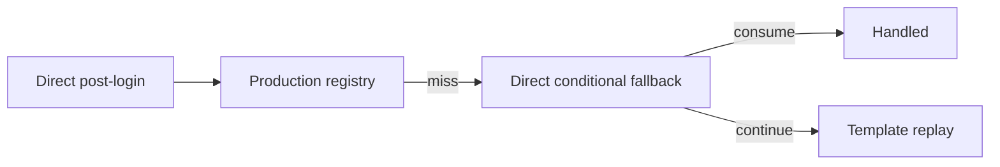

# Direct Conditional Fallback Routing 设计

Feature Name: gc-direct-conditional-fallback-routing
Updated: 2026-07-25
Status: Completed

## Description

本切片将 direct post-login registry miss 后的条件 fallback 收敛到一个显式 helper。`GBE_HandleDotaDirectPostLoginRequest()` 保持主流程：restore shared state、parse direct context、dispatch registry、evaluate conditional fallback、then template replay。

## Architecture

## Components and Interfaces

- `dll/gbe_dota_post_login_handlers.cpp`: owns direct post-login request handling and will define the explicit conditional fallback helper.
- `docs/gc/MESSAGE_ROUTING_INVENTORY.md`: documents direct fallback ownership for `8744`, `5410`, and `5432`.
- `tools/_audit_gc_refactor.py`: adds an audit that keeps the helper and inventory aligned.
- `tools/test_audit_gc_refactor.py`: adds focused regression tests for the direct fallback audit.

## Data Models

本切片不引入持久状态。The helper returns a small decision value that distinguishes consumed requests from requests that should continue to template replay.

## Correctness Properties

1. Registry dispatch remains the primary path before any fallback evaluation.
2. `8744` remains observe-only and still reaches template replay.
3. `5410` and `5432` remain conditional consume paths only when `GBE_ShouldTrackDotaPracticeLobbyLateSteamChain()` is true.
4. Template replay receives the same request data when fallback does not consume.

## Error Handling

- Parse failure remains handled by `GBE_ParseDirectProtoContext()` before registry or fallback evaluation.
- Unknown direct registry misses continue to template replay and preserve existing miss behavior there.
- Wrapped miss behavior remains owned by `GBE_HandleDotaWrappedPostLoginRequest()`.

## Test Strategy

- Add audit tests for helper presence, expected fallback emsg ownership, and inventory alignment.
- Keep handler smoke and replay fixtures green through full GC verification.
- Execute `bash tools/run_gc_verification.sh --full`.
- Execute `git diff --check`.
