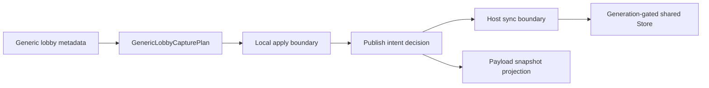

# Generic Metadata Publish 后续设计

Feature Name: gc-generic-metadata-publish
Updated: 2026-07-25
Status: 待实施

## 描述

该设计将 generic metadata 的 Local capture 与 shared publish 决策保持为两个连续且独立的边界。capture 继续产出并应用 `GenericLobbyCapturePlan`；调用路径依据角色、协议副作用和消费目的选择 host sync、client observe 或 pure projection。实现阶段只扩展 publish 决策，不改变现有 generic 字段解析与 Local apply 语义。

## 架构

## 组件与接口

- `Steam_Game_Coordinator::GBE_CaptureCurrentDotaLobbyState()`：保留 metadata 读取、plan 组合、Local apply 与 payload projection 行为。
- `Steam_Game_Coordinator::GBE_SyncCapturedDotaLobbyState()`：作为 host 权威 publish intent 的候选唯一入口，继续拒绝 client 触发。
- `Steam_Game_Coordinator::GBE_PublishSharedDotaLobbyState()`：保留 generation-gated Store 写入和 reconnect context 更新。
- `gbe::dota_lobby_state::compose_generic_lobby_capture_plan()` 与 `apply_generic_lobby_capture_plan()`：维持纯字段计划与一次 Local apply。

## 正确性属性

1. 每个 generic metadata 调用路径明确归属 host sync、client observe 或 payload projection 三种模式之一。
2. Host sync 使用 Local apply 之后的同一工作副本作为 publish 输入。
3. Payload projection 保持纯读取属性。
4. Store 继续以 generation gate 拒绝陈旧 publish。

## 错误处理

- capture 发现 inactive lobby、无效 generic lobby 或不可用 matchmaking 时，沿用现有 false/原快照结果。
- host sync 发现 client 角色时，沿用当前 false 结果。
- Store 拒绝陈旧 generation 时，沿用 `GBE_PublishSharedDotaLobbyState()` 的诊断路径。

## 测试策略

- 在 `tools/gbe_dota_lobby_state_test/gbe_dota_lobby_state_test.cpp` 增加 plan/apply 与 generation 竞争的 focused 覆盖。
- 在 handler smoke 覆盖 host sync、client observe、cache/replay/details pure projection 与 outbound 顺序。
- 执行 `bash tools/run_gc_verification.sh --full`。
- 执行 `git diff --check`。

## 实施任务

详细任务见 `tasklist.md`；生产 C++ 改动留待该规格被认领后实施。
