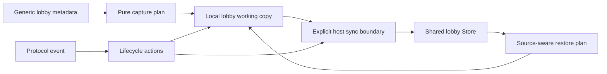

# GC Launch Runtime 单写入设计

Feature Name: gc-launch-runtime-single-write
Updated: 2026-07-25

## 描述

本设计将 launch/runtime 字段的写入收敛到已存在的 plan、lifecycle action 和专用 apply 边界，并将 generic capture、shared publish 与 shared restore 的双轨状态关系改为显式字段来源和同步边界。`GBE_local_lobby` 继续作为当前 GC 的运行时工作副本；shared Store 继续承载 host 权威的跨 GC 快照。切片以字段组为单位迁移，避免同时改变状态所有权、协议副作用和对象结构。

## 架构



## 组件与接口

### Launch runtime apply 边界

- 输入：当前 Local 工作副本、字段组 plan 或 lifecycle action。
- 职责：一次应用 `state`、`game_state`、`launch_phase` 与相关 `launch_*` 字段。
- 输出：用于后续 action、publish 或 response 的已更新 Local 工作副本。
- 禁止职责：直接发送协议消息、绕过 generation gate 写 shared Store、修改成员或 host 权威字段。

### Lifecycle executor

- 继续执行已有 `LobbyStateApply`、`LaunchPhaseMark`、`SharedLobbyPublish` 和详情更新 action。
- 维持 action list 顺序作为 response、push、publish 与 deferred work 的唯一可观察序列。

### Shared Store 与 restore

- Host 路径继续经 `GBE_PublishSharedDotaLobbyState` 发布 Local 工作副本快照。
- Store 继续使用 generation gate 拒绝陈旧 publish 和 update。
- Client 路径继续使用 restore coordinator 的字段级恢复规则，保留 ready-up 回归保护和角色语义。

### Generic capture 与同步选择

- `GBE_CaptureCurrentDotaLobbyState()` 的 generic metadata 读取将产出纯 capture plan。
- capture plan 只描述字段值、字段存在性和来源，不执行 Store 写入或协议副作用。
- 调用方使用显式模式选择 Local apply、snapshot-only 或 host sync；host sync 复用 `GBE_PublishSharedDotaLobbyState()`。
- details、cache 和 replay 调用路径保持 snapshot-only，避免读取 metadata 时隐式改写 shared Store。

### Source-aware restore

- restore plan 为 runtime identity 与 launch state 记录 shared 值、Local 值和字段写许可。
- host-published shared 快照是 client observe 的权威输入。
- generic capture 的同 generation Local 更新遵循字段组规则，阻止旧 shared runtime identity 回填。
- server adopt 保留既有角色语义；迁移后通过同一 restore plan 说明其字段组结果。

## 数据模型

第一阶段字段组：

```text
LaunchRuntimeFields
  state: uint32
  game_state: uint32
  launch_phase: uint32
  launch_4511_seen: bool
  remaining launch_* flags: existing field types

RuntimeIdentityFields
  room_name: string
  connect: string
  match_id: uint64
  server_id: uint64
  game_start_time: uint32

CaptureSource
  generic_captured: bool
  host_published: bool
  client_observed: bool
```

切片实施时只将实际同一协议边界内共同变更的字段放入 apply 请求。未被该边界修改的字段保持原值。

## 正确性属性

1. 每个迁移的协议路径在 Local 工作副本上只经过一个字段组 apply 边界。
2. Host publish 发生在显式同步边界，并使用更新后的 Local 工作副本。
3. Client restore 保留 shared snapshot 的 generation、ready-up 回归和 host 权威检查。
4. 同 generation shared restore 不覆盖规则判定为较新的 Local runtime identity。
5. 任一 deferred slot 在执行时继续验证 lobby id 与 generation。
6. 第一阶段不改变 members、chat 或 owner_hero_id 的字段所有权。

## 错误处理

- transition、capture 或 generation gate 拒绝时，调用方保留现有 early-return 和 diagnostic reason 行为。
- apply 边界不执行外部副作用，因此失败路径由既有 handler 或 executor 负责响应和记录。
- restore plan 拒绝字段覆盖时，保留 Local 值并记录字段来源。
- 已有 Store reject 结果继续防止陈旧 shared 快照覆盖较新 lifecycle。

## 测试策略

- 为每个迁移边界增加 focused flow 或 lifecycle state-machine 测试，验证字段组、来源和 Local/shared 结果。
- 使用 handler smoke 验证 response、push、publish 和 deferred action 的顺序。
- 增加同 generation 的 Local runtime 更新与旧 shared restore 竞争测试。
- 使用 Store 与 reconnect 测试保持 generation 和异步 gate 的覆盖。
- 每个提交运行 `bash tools/run_gc_verification.sh --full` 与 `git diff --check`。

## 实施切片

1. 将 `GBE_CaptureCurrentDotaLobbyState()` 的 metadata 读取与 Local apply 分离，先覆盖 snapshot-only 调用路径。
2. 引入 generic capture 的显式同步选择，保持 host publish 和 payload 顺序。
3. 将 runtime identity 与 launch state restore 迁移为 source-aware restore plan，覆盖同 generation 竞争。
4. 增加 focused 回归、handler smoke 和写入口清单记录。
5. 通过完整验证后进入 generic metadata publish、8052 lifecycle pre-write 和 chat tombstone 的独立规格。

## 参考

- `docs/gc/LOCAL_LOBBY_USAGE.md`
- `docs/gc/PHASE_D_BOUNDARY.md`
- `dll/gbe_dota_lifecycle_state_machine.h`
- `dll/gbe_dota_lobby_flow.cpp`
- `dll/gbe_dota_lobby_state_restore_coordinator.cpp`
