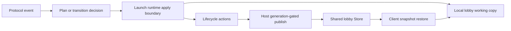

# GC Launch Runtime 单写入设计

Feature Name: gc-launch-runtime-single-write
Updated: 2026-07-25

## 描述

本设计将 launch/runtime 字段的写入收敛到已存在的 plan、lifecycle action 和专用 apply 边界。`GBE_local_lobby` 继续作为当前 GC 的运行时工作副本；shared Store 继续承载 host 权威的跨 GC 快照。切片以字段组为单位迁移，避免同时改变状态所有权、协议副作用和对象结构。

## 架构



## 组件与接口

### Launch runtime apply 边界

- 输入：当前 Local 工作副本、字段组 plan 或 lifecycle action。
- 职责：一次应用 `state`、`game_state`、`launch_phase` 与相关 `launch_*` 字段。
- 输出：用于后续 action、publish 或 response 的已更新 Local 工作副本。
- 禁止职责：直接发送协议消息、绕过 generation gate 写 shared Store、修改成员或 host 权威字段。

### Lifecycle executor

- 继续执行已有 `LobbyStateApply`、`LaunchPhaseMark`、`SharedLobbyPublish` 和详情更新 action。
- 维持 action list 顺序作为 response、push、publish 与 deferred work 的唯一可观察序列。

### Shared Store 与 restore

- Host 路径继续经 `GBE_PublishSharedDotaLobbyState` 发布 Local 工作副本快照。
- Store 继续使用 generation gate 拒绝陈旧 publish 和 update。
- Client 路径继续使用 restore coordinator 的字段级恢复规则，保留 ready-up 回归保护和角色语义。

## 数据模型

首个字段组：

```text
LaunchRuntimeFields
  state: uint32
  game_state: uint32
  launch_phase: uint32
  launch_4511_seen: bool
  remaining launch_* flags: existing field types
```

切片实施时只将实际同一协议边界内共同变更的字段放入 apply 请求。未被该边界修改的字段保持原值。

## 正确性属性

1. 每个迁移的协议路径在 Local 工作副本上只经过一个 launch/runtime 写入边界。
2. Host publish 发生在既有 action list 定义的位置，并使用更新后的 Local 工作副本。
3. Client restore 保留 shared snapshot 的 generation、ready-up 回归和 host 权威检查。
4. 任一 deferred slot 在执行时继续验证 lobby id 与 generation。
5. 首个字段组不修改 members、chat、owner_hero_id、server_id、connect 或 match_id。

## 错误处理

- transition 或 generation gate 拒绝时，调用方保留现有 early-return 和 diagnostic reason 行为。
- apply 边界不执行外部副作用，因此失败路径由既有 handler 或 executor 负责响应和记录。
- 已有 Store reject 结果继续防止陈旧 shared 快照覆盖较新 lifecycle。

## 测试策略

- 为每个迁移边界增加 focused flow 或 lifecycle state-machine 测试，验证字段组和值。
- 使用 handler smoke 验证 response、push、publish 和 deferred action 的顺序。
- 使用 Store 与 reconnect 测试保持 generation 和异步 gate 的覆盖。
- 每个提交运行 `bash tools/run_gc_verification.sh --full` 与 `git diff --check`。

## 实施切片

1. 盘点 `state`、`game_state` 与 `launch_*` 的生产写入点，选择已有 action/executor 支持的一条协议路径。
2. 为该路径引入或复用纯 plan 与单次 apply 边界，并保持 action/response 顺序。
3. 增加 focused 回归和写入口清单记录。
4. 通过完整验证后提交，再选择下一条路径。

## 参考

- `docs/gc/LOCAL_LOBBY_USAGE.md`
- `docs/gc/PHASE_D_BOUNDARY.md`
- `dll/gbe_dota_lifecycle_state_machine.h`
- `dll/gbe_dota_lobby_flow.cpp`
- `dll/gbe_dota_lobby_state_restore_coordinator.cpp`
