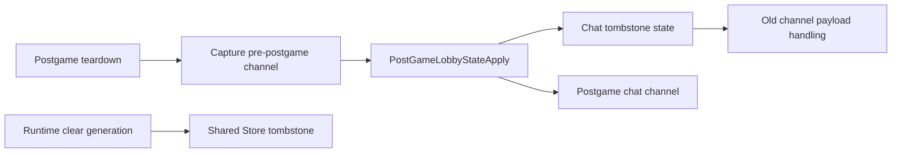

# Postgame Chat Tombstone 后续设计

Feature Name: gc-postgame-chat-tombstone
Updated: 2026-07-25
Status: 已完成

## 描述

该设计将 postgame 的旧 chat channel 标识从隐含清理条件提升为独立 tombstone 状态。postgame action 继续保持 state、chat 与 cache 的单次 apply；chat handler 使用 tombstone 判定旧 channel payload；runtime clear 继续依赖 shared Store 的 generation tombstone。实现阶段保持当前 postgame push、deferred reset 和 Store gate 语义。

## 架构

## 组件与接口

- `Steam_Game_Coordinator::GBE_QueueDotaPostGameTeardown()`：继续捕获旧 channel，创建 postgame payload 与 action list。
- `gbe::dota_lobby_flow::postgame_teardown_action_list()`：继续表达 postgame apply、push 和 deferred reset 的顺序。
- `gbe::dota_lobby_state::apply_postgame_lobby_state_plan()`：保持 state、chat、cache 字段组的一次 apply。
- chat handler 中使用 `abandon_pre_postgame_chat_channel_id` 的判定点：作为 tombstone 消费行为的候选收敛入口。
- `Steam_Game_Coordinator::GBE_ClearDotaLobbyRuntimeState()` 与 `Store::compare_clear()`：保持 generation-scoped runtime clear。

## 正确性属性

1. 每个 postgame teardown 明确记录旧 channel 是否进入 tombstone 状态。
2. tombstone 消费只影响匹配的 lobby 与 generation。
3. postgame 新 channel 与旧 channel tombstone 可并存到清理边界。
4. runtime clear 保留 Store 的 same-generation republish 拒绝属性。

## 错误处理

- 没有 active lobby、缺少 wrapped session context 或 payload 构建失败时，沿用 `GBE_QueueDotaPostGameTeardown()` 的现有返回和日志。
- tombstone channel 与 payload 不匹配时，沿用既有 chat 路由结果。
- Store 返回陈旧 generation 时，沿用 runtime clear 的现有诊断。

## 测试策略

- 在 `tools/gbe_dota_lobby_state_test/gbe_dota_lobby_state_test.cpp` 覆盖 postgame plan 的 state/chat/cache 原子 apply。
- 在 handler smoke 覆盖 old channel payload、postgame join、7272/7014 后的 cleanup 与新 generation lobby。
- 执行 `bash tools/run_gc_verification.sh --full`。
- 执行 `git diff --check`。

## 实施任务

详细任务见 `tasklist.md`；生产 C++ 改动留待该规格被认领后实施。
