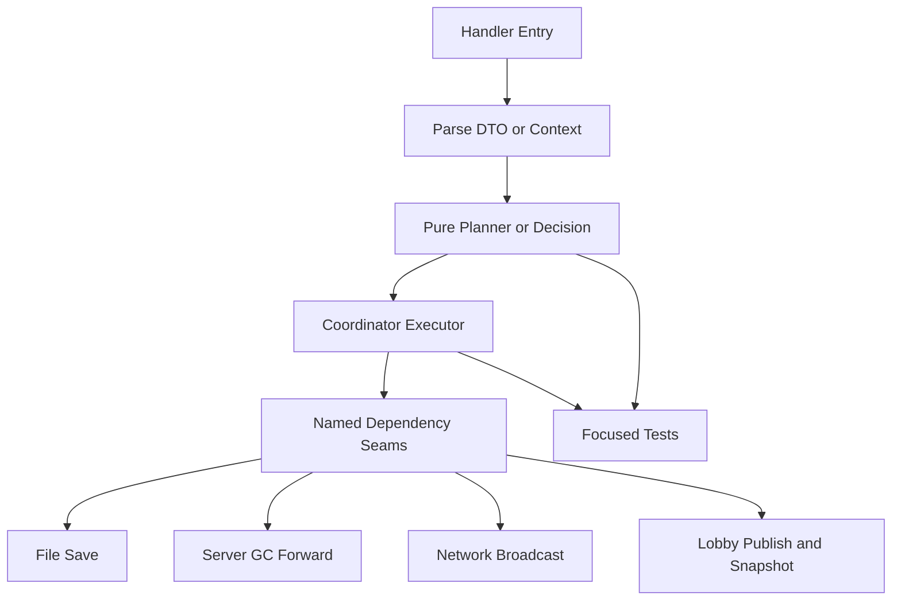

# GC Refactor Follow-Up Technical Design

Feature Name: gc-refactor-follow-up
Updated: 2026-07-05

## Description

This design defines the next wave of Dota GC architecture refactoring after staged coordinator cleanup. The work continues the existing strategy: protect current protocol behavior with focused tests, move logic into pure helper or decision boundaries, and keep real side effects explicit in coordinator executors. The design favors small state-group migrations and named seams over broad framework changes.

## Architecture



The handler entry remains on `Steam_Game_Coordinator` for compatibility. Parser/DTO logic lives near wire helpers. State decisions live in domain state helpers such as `gbe_dota_lobby_state.*`. Executors remain close to the handler domain until at least two handlers share the same execution pattern.

## Components And Interfaces

### Production Build And Runtime Validation

The build validation path keeps `tools/run_gc_verification.sh` as the local baseline and adds a recorded Premake gate when tooling exists. Runtime validation notes should focus on chains that depend on client timing or cross-module callbacks.

Key entrypoints:
- `tools/run_gc_verification.sh`
- `tools/run_gc_offline_tests.sh --full`
- `premake5 --with-gc-tests gmake2`

### Narrow Header Boundaries

The current `gbe_dota_gc_internal.h` remains a transitional aggregation point. Future moves should use small headers with domain names and explicit ownership.

Candidate headers:
- `gbe_dota_payload_wire_helpers.h` for DTO parser and wire patch declarations.
- `gbe_dota_payload_lobby_helpers.h` for lobby cache/details/launch payload declarations.
- `gbe_dota_replay_template_helpers.h` only if replay/template declarations need a public boundary.

Migration rules:
- Move one declaration group at a time.
- Update includes in production and tests in the same change.
- Run audit after each move.

### Dependency Seams

The first seam, `GBE_SaveDotaItemsFromExecutor(reason)`, establishes the pattern. Additional seams should be coordinator member functions or domain-level coordinator helpers with explicit reason strings.

Candidate seams:
- `GBE_ForwardDotaItemsToServerGcFromExecutor(reason, ...)`
- `GBE_BroadcastDotaEquippedItemsFromExecutor(reason, ...)`
- `GBE_PublishDotaLobbyFromExecutor(reason, ...)`
- `GBE_RefreshDotaLobbySnapshotFromExecutor(reason, ...)`

Names can change during implementation, but each seam must preserve current action order and test visibility.

### Action Plan Executor

`EquipItemsPlan` currently describes ordered actions. The next step is a local executor function in `gbe_dota_inventory_handlers.cpp` that consumes the plan and performs side effects.

Expected executor shape:

```cpp
static bool execute_equip_items_plan(
    Steam_Game_Coordinator &coordinator,
    const EquipItemsPlan &plan,
    const EquipItemsExecutionContext &context);
```

The executor should stay local until another inventory handler uses the same pattern. The execution context should contain only values needed for side effects, such as source job, local steam id, server GC availability, and snapshot availability.

### Runtime State Accessors

State migration continues through accessors first and storage changes later. Suitable next targets are small state groups with limited call sites.

Candidate order:
- Host showcase flag.
- Server hello cache.
- Launch/sync flags.
- Small internal storage struct for already-encapsulated pending flow and reconnect cache.

`GBE_local_lobby` and `GBE_shared_dota_lobby_state` should remain out of broad struct migration until publish/restore/details update write paths are narrower.

### Routing Registry

The post-login dispatch table can absorb more simple handlers. Direct-only handlers should keep a path guard. Wrapped-compatible handlers should preserve session and target/source job behavior.

Candidate migrations:
- Profile/card minimal responses.
- Inventory simple request-response handlers.
- Emoticon, conduct, coaching summary stable responses.

Complex paths remain explicit until tests cover template replay and fallback behavior.

## Data Models

### Execution Intent

Execution intent should be represented as existing domain plan structs or small local structs. Intent objects may include response payloads, item ids, reason strings, and enum action types. Intent objects must not own coordinator pointers, mutable global references, network objects, or file handles.

### Runtime State Groups

State groups should expose get/set/consume/clear functions before storage is moved. Functions should use value types for inputs and outputs, especially for queued or delayed actions.

## Correctness Properties

- Pure helpers do not call file save, network broadcast, server GC forward, lobby publish, snapshot refresh, or coordinator mutation functions.
- Executors preserve existing observable action order for SO update, response, save, server GC forward, network broadcast, and snapshot refresh.
- Header declaration moves preserve one definition per public declaration and no under-exposed shared free functions.
- Registry migrations preserve direct/wrapped path guard semantics.
- Reason strings remain stable unless task docs and tests are updated together.

## Error Handling

- Premake unavailable: record the limitation and keep wrapper verification passing.
- Source-list mismatch: stop the task and update shell/Premake membership before continuing logic changes.
- Audit failure: fix declaration, dispatch, line reference, or template ownership issue before marking the task complete.
- Runtime validation gap: record the missing live-client scenario and avoid claiming runtime equivalence.

## Test Strategy

Default task completion gate:

```bash
tools/run_gc_verification.sh
```

Iterative gate:

```bash
tools/run_gc_verification.sh --fast
```

Focused coverage to add:
- Equip executor action order with server GC, network broadcast, and snapshot refresh.
- Host showcase flag accessor behavior in 7034 showcase repush.
- Server hello cache accessor behavior in direct server hello and welcome replay.
- Registry audit expectations for each migrated simple handler.
- Audit rule for ordinary handler files calling newly seam-protected side effects.

Premake gate in a tooling-ready environment:

```bash
premake5 --with-gc-tests gmake2
```

## References

- `.monkeycode/specs/gc-refactor-next-steps/tasklist.md`
- `.monkeycode/specs/gc-refactor-next-steps/dependency-seam-error-boundary.md`
- `.monkeycode/specs/gc-refactor-next-steps/build-entrypoint-equivalence.md`
- `.monkeycode/specs/gc-refactor-next-steps/reason-trace-governance.md`
- `.monkeycode/specs/gc-refactor-next-steps/template-replay-ownership.md`
