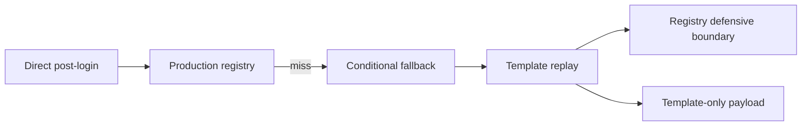

# Template Registry Defensive Routing 设计

Feature Name: gc-template-registry-defensive-routing
Updated: 2026-07-25
Status: Completed

## Description

本切片将 template replay 中的 registry-defensive cases 收敛到显式边界，减少路由真相表中的混合职责。`GBE_HandleDotaTemplateReplayRequest()` 继续拥有 template-only canned/synthetic payload，post-login registry 继续拥有已注册 emsg 的生产路径。

## Architecture

## Components and Interfaces

- `dll/gbe_dota_template_replay_handlers.cpp`: 当前 registry-defensive 转调位置，候选 emsg 为 `8879`、`8095`、`8009`、`7091`。
- `dll/gbe_dota_post_login_dispatcher.cpp`: registry 主路径，继续作为 registry-owned emsg 的权威入口。
- `docs/gc/MESSAGE_ROUTING_INVENTORY.md`: 先更新后改代码，记录 registry-defensive 所有权和迁移状态。
- `tools/_audit_gc_refactor.py`: 保持 dispatch、template ownership 与 handler seam 审计通过；必要时增加 registry-defensive ownership 审计。

## Data Models

本切片不引入生产持久状态。若需要纯 helper，只使用 request emsg、body、source job 和 direct/wrapped 元数据构造显式 routing decision。

## Correctness Properties

1. Registry-owned emsg 的 primary path 仍是 `GBE_DispatchDotaPostLoginRequest()`。
2. Template-only emsg 的 response emsg、payload source、source job 语义保持。
3. Registry-defensive 转调的 direct semantics 与现有 fallback 行为等价。
4. Template miss 行为保持现有日志和 return value。

## Error Handling

- defensive boundary 无法匹配 registry-owned emsg 时，继续进入 template-only switch 或 miss 日志。
- registry-owned handler 返回 false 时，沿用该 handler 的现有 failure 语义。
- wrapped post-login miss 继续为 hard miss，不落 template replay。

## Test Strategy

- 增加或更新审计，确保 registry-defensive emsg 列表与 `MESSAGE_ROUTING_INVENTORY.md` 同步。
- 保持 `gc_replay_test` 全 fixture 匹配。
- 保持 handler registry audit、template blob ownership audit 与 side-effect seam audit 通过。
- 执行 `bash tools/run_gc_verification.sh --full`。
- 执行 `git diff --check`。
