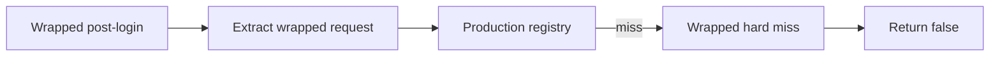

# Wrapped Hard Miss Routing 设计

Feature Name: gc-wrapped-hard-miss-routing
Updated: 2026-07-25
Status: Completed

## Description

本切片将 wrapped post-login registry miss 后的 hard-miss log 和 false return 收敛到一个显式 helper。`GBE_HandleDotaWrappedPostLoginRequest()` 保持主流程：extract wrapped request、supported gate、dispatch registry、then hard miss。

## Architecture

## Components and Interfaces

- `dll/gbe_dota_post_login_handlers.cpp`: owns wrapped post-login request handling and will define the explicit hard-miss helper.
- `docs/gc/MESSAGE_ROUTING_INVENTORY.md`: documents wrapped miss ownership as `HARD_MISS`.
- `tools/_audit_gc_refactor.py`: adds an audit that keeps the helper and inventory aligned.
- `tools/test_audit_gc_refactor.py`: adds focused regression tests for wrapped hard-miss routing.

## Data Models

本切片不引入持久状态。The helper accepts the parsed `DotaGcRequestContext` and returns false after logging.

## Correctness Properties

1. Wrapped registry dispatch remains the primary path before hard miss.
2. Wrapped hard miss remains a hard stop and does not enter template replay.
3. The B4 dead SetTeamSlot fallback remains absent.
4. Direct conditional fallback remains independent.

## Error Handling

- Wrapped extract failure still returns false before registry dispatch.
- Unsupported wrapped request still returns false before registry dispatch.
- Registry miss logs the same request metadata and returns false.

## Test Strategy

- Add audit tests for helper presence, ordering after registry dispatch, absence of template replay / SetTeamSlot fallback, and inventory alignment.
- Keep handler smoke and replay fixtures green through full GC verification.
- Execute `bash tools/run_gc_verification.sh --full`.
- Execute `git diff --check`.
